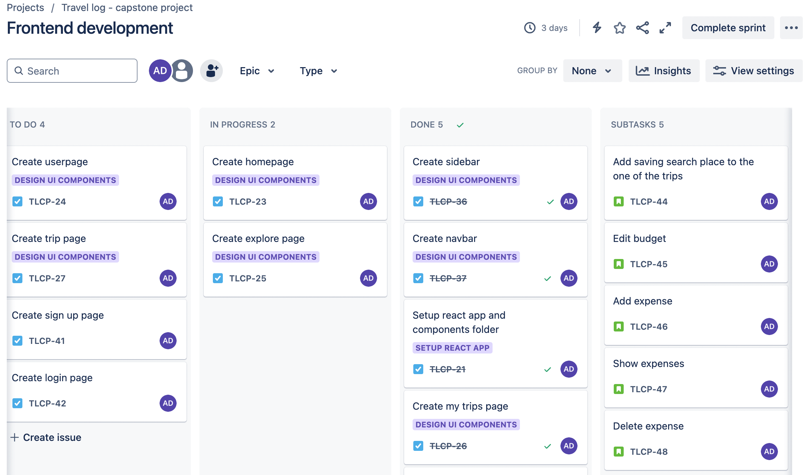
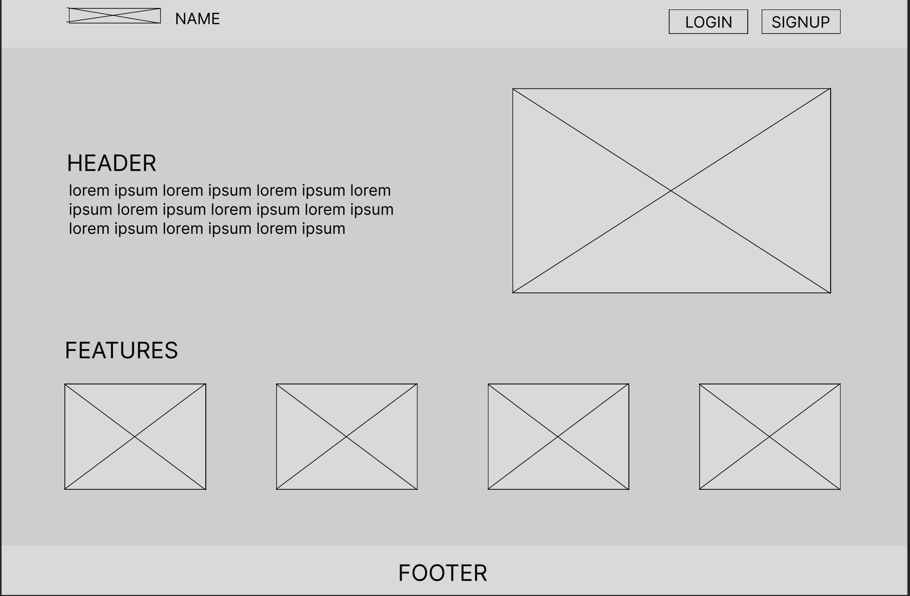
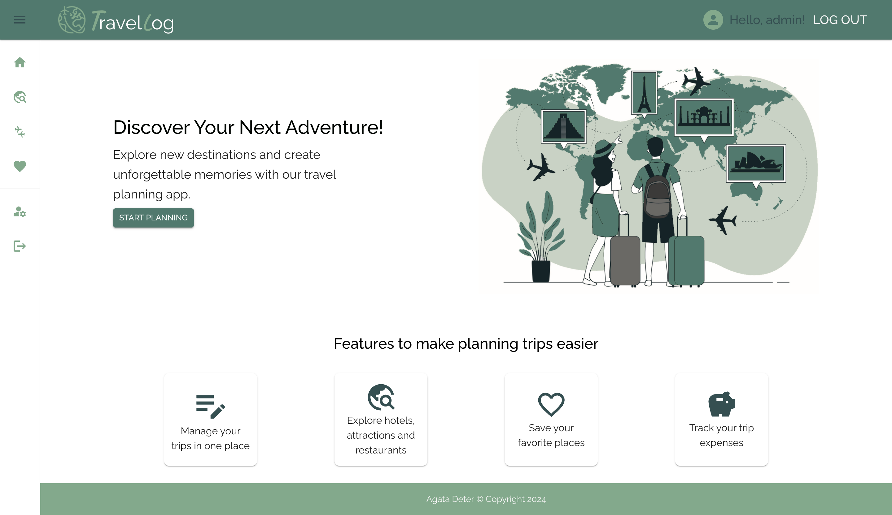
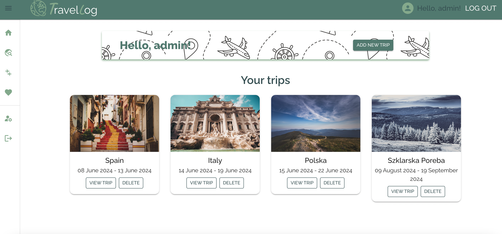

# travel-log

Application for tracking your trips in one place, add trips, places, your favourtie places, track your budget for a given trip and your expenses, explore restaurants and attractions !

## Table of Contents

[About](#about)
 [Technologies](#technologies)
  [Features](#features)
 [Challenges](#challenges)
     [Future app possibilities](#possibilities)
  [What I learned](#what-i-learned)
 [Screenshots](#screenshots)
 [Run Locally](#run-locally)
 [API routes](#api-routes)
  [Database](#database)

## About
The application allows user to track their trips in one place. The can add places to it, budget, expenses and create their own itinerary. What is more, the website provides map for searching new places: hotels, restaurants and attractions for chosen location.
 
Frontend part was created using Vite and React. I used many packages that are listed below for better user experience. I styled application with Materail UI, Tailwind CSS and CSS. For form validation I used react-material-ui-form-validator that allows use validator checks and easily display errors.
 
Backend was created using Express.js. I used jwt token for the user authentication and personal data security, bcrypt for hashing the user password.
 
For UI/UX design I used Figma to create wireframes. What is more, I managed my project using Jira Software that allowed me to track my sprints, add issues and track overall progress of my project.

## Technologies

| Frontend              | Backend                      |
| :-------------------------------- | :----------------------------------------- |
| React               | Node.js                         |
| Vite    | Express.js     |
| CSS / Tailwind CSS / Material UI           | MongoDb / mongoose           |
| dayjs       | validator                 |
| leaflet       |jwt |
| react-loader-spinner/ react-router-dom | bcrypt         |

**API used**:
1. Geoapify - autocomplete & map tiles
2. Travel Advisor - searching places based on categories.
3. Unsplash - for places images

## Features

1. Explore page
 - Search for places near you or from the location you enter in search bar. Filter places by hotels, restaurants, attractions or rating.
 - See places on map
 - Add places from search list to your favorites
 - Add places from search list to your trip

2. Trips page
 - Add, view or delete trips
 - Add starting date and end date to your trip.

3. Single trip page
 - Edit your trip, change name or dates
 - Add notes so you won't forget anything
 - Set your limits - add budget, add expenses and track how much you spend
 - Look for places to add to your trip, add address and notes to them

4. Favorites page
- Edit or delete your fav places
- Add address or notes

5. Profile page
- Edit your profile
- Delete your account

## Future app possibilities

The application can have some improvements like:
1. Adding search bar for favorties places page, so user can search for places if they grow in number.
2. Change display of iternary, so user can edit the places, add address and notes.
3. Try to implement different map holder, not leaflet so the tooltip are following the mouse, and I could use z-index for hovering over them.
4. Add e-mail confirmations.
5. Because of the API limits I didn't applied it to search bar on single trip page, in places to visit section. For future app improvements, I would add autocomplete API to it.

## What I learned

**BACKEND**
1. How to use reference to other documents in mongoose Schema.
2. How to use JWT token:
Token contains three parts:

`Header` - which contains type of token and the siging version of algorithm used.
 

`Payload` - which is information about user(but not password!)
 

`Signature` - created using encoded header, encoded payload and secret
3. How to use bcrypt package to hash password using salt rounds.

**FRONTEND**
1. I learned how to combaine map tiles API with leaflet package for react. How to append markers on map, and change position based on map corners(longitude and latitiude).
2. I learned how to use Material UI and how to create new components based on one from Material UI, manipulate the styles of components.
3. I learned how to manage the state in such complex application.

## Run Locally

1. Clone the project `git clone https://link-to-project`
2. Go to the project directory `cd backend`
3. Install packages `npm install`
4. Create `.env` file and include your `ATLAS_URI`, optionally include `PORT`, `SALT_ROUNDS`, and `JWT_SECRET`. Do step from 2 to 4 for frontend(step 4 has different env variables).
5. Run with node.js `nodemon server` or `node server`(in backend folder). Run `npm run dev` (in frontend)
6. In browser `http://localhost:8080/` or `http://localhost:3000/`

## Screenshots
1. For better project managment I used Jira to track sprints and project progress/issues.
    
2. Wireframe created using Figma
    
3. Homepage
    
4. Trips page
    

## Database
 
      

## API routes

- **GET** / -- Logging connection to API.

  - **GET** /api/users -- Get user with given id.
  - **PUT** /api/users/:id -- Update user with given id.
  - **DELETE** /api/users/:id -- Detele user with given id.

  - **POST** /api/trips -- Create a trip.
    - **GET** /api/trips/trip/:tripId -- Get single trip.
    - **GET** /api/trips/:userId -- Get all trips for specific user.
    - **PUT** /api/trips/:id -- Update the trip with given id.
    - **DELETE** /api/posts/:id -- Delete the trip with given id.
      - **GET** /api/trips/:id/expenses -- Get all expenses for given trip.
      - **GET** /api/trips/:id/places -- Get all places for given trip.
      - **GET** /api/trips/:id/places/:date -- Get all places for a given itinerary day.

  - **POST** /api/places -- Create a place.
    - **PUT** /api/places/:id -- Update the place.
    - **DELETE** /api/places/:id -- Delete the place.
      - **PUT** /api/places/:id/favorites -- Update the favorite property for the place.
      - **GET** /api/places/favorites/:userId -- Get favorites places for specific user.

  - **POST** /api/expenses -- Create expense.
    - **PUT** /api/expenses/:id -- Update expense.
    - **DELETE** /api/expenses/:id -- Delete expense.

  - **POST** /login -- Login an exisiting user.
  - **POST** /signup -- Create a new user.

